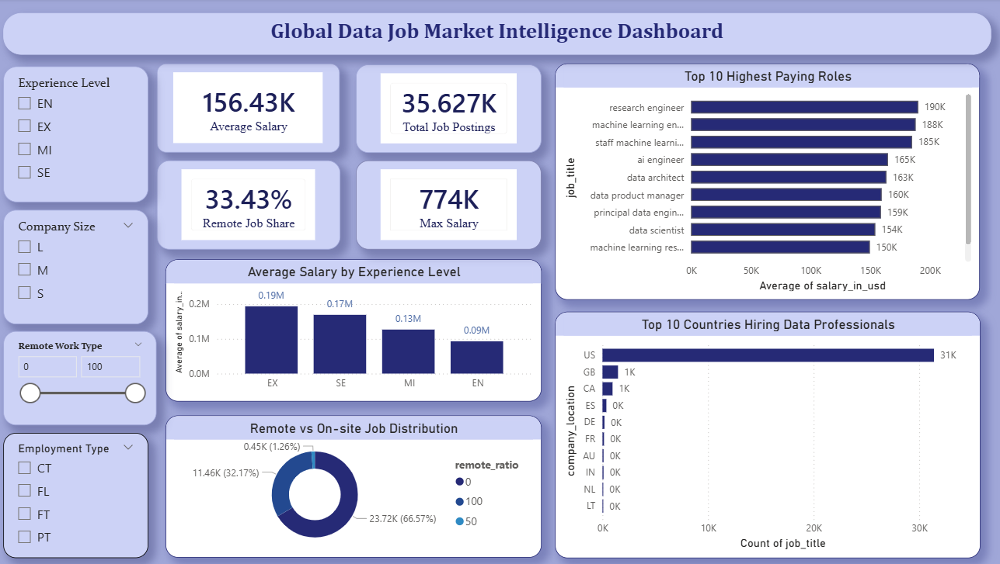

# 🌍 Global Job Market Intelligence

An **end-to-end data analytics project** analyzing global job market trends using **SQL, Python, Power BI, and Machine Learning**.

This project explores **salary trends, job roles, experience levels, and remote work distribution** while also building a **machine learning model to predict salaries**.

The project demonstrates the **complete Data Analytics workflow**:

Raw Data → Data Cleaning → SQL Analysis → Exploratory Data Analysis → Dashboard Visualization → Machine Learning Prediction

---

# 📌 Project Overview

The global job market is evolving rapidly with changes in **remote work adoption, skill demand, and salary structures**.

This project analyzes job market data to uncover meaningful insights such as:

- Highest paying job roles
- Salary distribution across experience levels
- Remote vs on-site work trends
- Job demand across countries
- Machine learning based salary prediction

---

# 🛠 Technologies Used

- Python
- SQL (SQLite)
- Power BI
- Pandas
- NumPy
- Matplotlib
- Seaborn
- Scikit-Learn
- Jupyter Notebook

---
# 🧹 Data Preparation

Before performing analysis, the datasets required several preprocessing steps to ensure data consistency and usability.

One of the key steps in this project was **merging two different datasets** to create a unified dataset for analysis and modeling.

### Dataset Integration

Two job market datasets were combined to build a more comprehensive dataset containing:

- Job roles
- Salary information
- Experience levels
- Company size
- Work location
- Remote work ratio

The datasets were merged using **common fields such as job role and company-related attributes** to ensure accurate alignment of records.

### Data Cleaning Steps

After merging the datasets, several preprocessing steps were performed:

- Handling missing values
- Removing duplicate records
- Standardizing categorical variables
- Converting salary values to a consistent format
- Creating a cleaned dataset for analysis

The final cleaned dataset was stored in: job_market_dataset.csv

---

# 📊 Dashboard

The **Power BI dashboard** provides interactive insights into the global job market including:

- Salary distribution across job roles
- Average salary by experience level
- Remote work percentage
- Top hiring countries
- Highest paying job roles

To explore the dashboard, open the `.pbix` file using **Power BI Desktop**.

---

# 🔎 Key Insights

- **35K+ global job postings** were analyzed, highlighting the strong demand for **data professionals across the global job market**.

- The **average salary for data roles is approximately $156K**, demonstrating the **high earning potential in data-driven careers**.

- **Remote work accounts for ~33% of job postings**, indicating the increasing adoption of **flexible work environments in the tech industry**.

- **Salary increases significantly with experience**, with **senior and executive roles earning substantially higher compensation** compared to entry-level positions.

- **Specialized roles such as Machine Learning Engineers, AI Engineers, and Data Architects** consistently rank among the **highest-paying positions**.

- The dataset shows **salary outliers reaching up to $774K**, indicating exceptional compensation in **highly specialized or leadership roles**.

- **Hiring demand is concentrated in major technology-driven countries**, reflecting where **data innovation and investment are strongest**.

- **Larger companies tend to offer higher average salaries**, suggesting that **established organizations have greater compensation capacity**.

---

# 🤖 Machine Learning Model

A **Linear Regression model** was built to predict salary using features such as:

- Job role
- Experience level
- Company location
- Remote work ratio

Model performance was evaluated using:

- Mean Absolute Error (MAE)
- Root Mean Squared Error (RMSE)
- R² Score

This demonstrates how **machine learning can help forecast salary trends and job market patterns**.

---

# 📈 SQL Analysis

SQL queries were used to analyze the dataset and extract valuable insights such as:

- Highest paying job roles
- Average salary by country
- Salary trends across experience levels
- Remote vs on-site job distribution

All SQL queries are available in:

sql/analysis_queries.sql

---

# ⚙️ Installation

Clone the repository:

git clone https://github.com/riya102002/Global-job-market-intelligence-project.git

Navigate to the project directory:

cd Global-job-market-intelligence-project

---

# 🚀 How to Run the Project

1. Run the notebooks in order:

01_data_preparation.ipynb  
02_data_cleaning.ipynb  
03_eda.ipynb  
04_sql_analysis.ipynb  
05_machine_learning.ipynb  

2. Execute SQL queries using SQLite.

3. Open the Power BI dashboard:

dashboard/Global Data Job Market Intelligence Dashboard.pbix

---

# 📦 Requirements

To run this project, install the following Python libraries:

pandas  
numpy  
matplotlib  
seaborn  
scikit-learn  
jupyter  

---

# ⚠️ Challenges Faced

Some challenges that users may face while running the project include:

- Missing Python libraries such as `scikit-learn`
- Dataset encoding issues
- Power BI file requiring **Power BI Desktop**
- SQLite database connection errors

These can be resolved by installing dependencies and verifying file paths.

---

# 🔮 Future Improvements

Possible future improvements for this project include:

- Implementing advanced machine learning models
- Deploying the dashboard online
- Integrating real-time job market data
- Building a web-based dashboard using Streamlit

---

# 👩‍💻 Author

**Riya Kesharwani**

Aspiring **Data Analyst | Data Science Enthusiast**

---

⭐ If you found this project useful, consider **starring the repository**.
